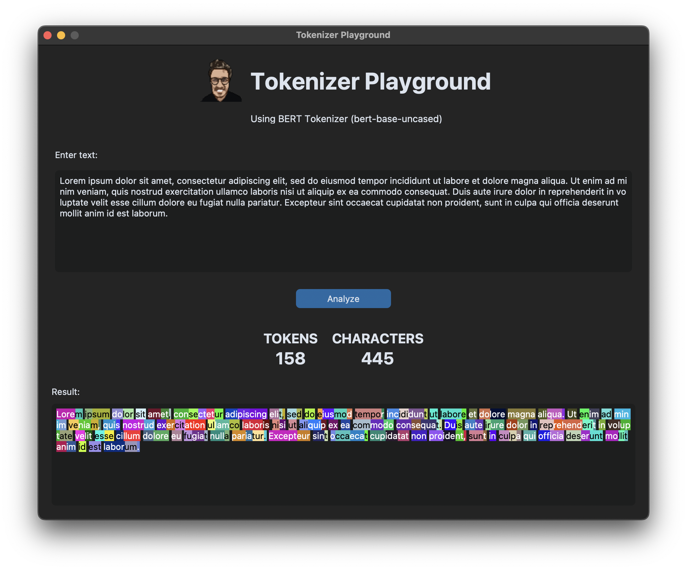
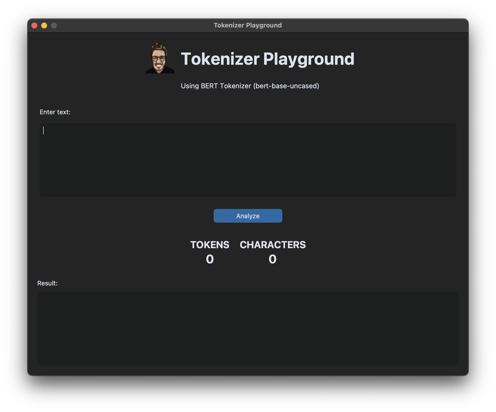

# Tokenizer Playground

Tokenizer Playground è una semplice applicazione sviluppata con Python e `CustomTkinter` che consente agli utenti di esplorare come i token vengono generati dal tokenizer di BERT (`bert-base-uncased`). Puoi inserire un testo, vedere i token generati, il numero di caratteri e il numero di token, e visualizzare ogni token evidenziato in modo casuale.

<p align="center">
  
</p>


## Funzionalità

- **Input di testo:** Inserisci del testo nel campo di testo per vedere come viene tokenizzato.
- **Conteggio Token e Caratteri:** Visualizza il numero di token e caratteri nel testo.
- **Evidenziazione dei Token:** I token vengono evidenziati nel campo di testo con un colore di sfondo casuale per facilitarne l'individuazione.
- **BERT Tokenizer:** Utilizza il modello `bert-base-uncased` di Hugging Face per tokenizzare il testo.

## Come funziona

1. **Carica il Modello BERT:** La libreria `transformers` di Hugging Face viene utilizzata per caricare il modello `bert-base-uncased` e il suo tokenizer.
2. **Interfaccia grafica:** L'interfaccia è costruita utilizzando `CustomTkinter`, una libreria che estende `Tkinter` per offrire una UI moderna e personalizzabile.
3. **Generazione dei Token:** Quando l'utente inserisce del testo e preme il pulsante "Analyze", il testo viene tokenizzato e ogni token viene evidenziato con un colore di sfondo generato casualmente. Inoltre, vengono mostrati il numero totale di token e di caratteri nel testo.

## Screenshot

<p align="center">
  
</p>
## Prerequisiti

Per eseguire questa applicazione, assicurati di avere i seguenti pacchetti installati:

- Python 3.x
- `transformers` (Hugging Face)
- `customtkinter`
- `PIL` (Pillow)

Puoi installarli utilizzando pip:

```bash
pip install transformers customtkinter pillow
```
Esecuzione

Clona il repository:
```bash
git clone https://github.com/yourusername/tokenizer-playground.git
cd tokenizer-playground
```
Esegui l'applicazione:
```bash
python app.py
```
L'app si avvierà e potrai iniziare a inserire del testo e vedere il risultato.
